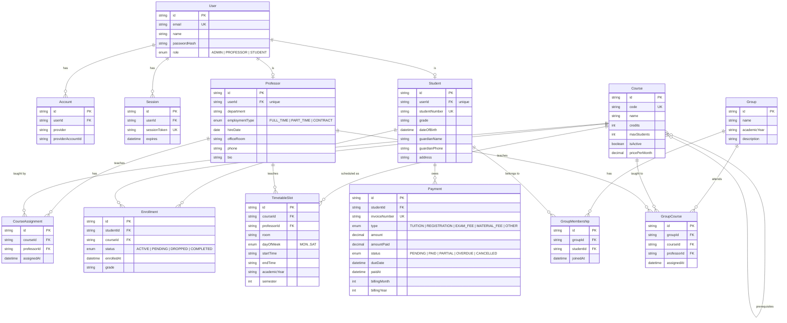

# Entity Relationship Diagram

## Notes

**Two paths for student–course association**

1. **Direct enrollment** (`Enrollment`) — admin enrolls a student in a specific course. Tracks individual grade and status.
2. **Group-based** (`GroupMembership` + `GroupCourse`) — students are placed in a group; courses are assigned to the group with a designated professor. This is the primary path for scheduling and billing.

**OVERDUE is computed, not stored** — `Payment.status` is always stored as `PENDING`. At read time, any `PENDING` payment past its `dueDate` is displayed as OVERDUE.

**`billingMonth` / `billingYear`** — only set on invoices created by the monthly generator. Manual payments leave these null.
